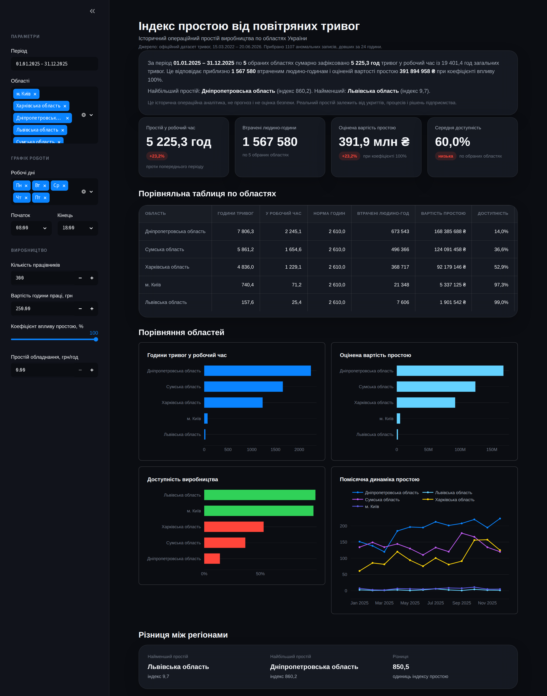

# Індекс простою від повітряних тривог

Аналітичний дашборд, який оцінює історичний операційний простій виробництва, спричинений повітряними тривогами в Україні, і порівнює області за втраченим робочим часом, людино-годинами та орієнтовною вартістю простою.

Проєкт зроблено для KSE AI Summer School. Це інструмент ретроспективної аналітики на основі офіційних даних про тривоги.



## Що це таке

Дашборд бере історію повітряних тривог по областях і накладає її на робочий графік підприємства (робочі дні та години), яке ви задаєте. На цій основі він рахує, скільки робочого часу було під тривогами, у скільки людино-годин і грошей це орієнтовно обійшлося, та наскільки доступним було виробництво в кожній області.

Цільовий користувач: власник, операційний менеджер або інвестор виробничого підприємства, якому потрібна кількісна картина минулих втрат від тривог по регіонах.

## Чим це НЕ є

Це важливо, тому окремим розділом.

Це історична аналітика, а не прогноз. Дашборд показує, що вже сталося, і нічого не передбачає про майбутнє.

Це не система безпеки і не військовий інструмент. Він не радить, куди ходити чи не ходити, не оцінює загрозу і не має жодного стосунку до фізичної безпеки людей.

Порівняння областей це операційна аналітика, а не вибір місця для життя чи роботи з міркувань безпеки. Менший простій у регіоні не означає, що там безпечніше.

Усі цифри вартості та людино-годин це оцінки за заданими вами припущеннями, а не фактичні бухгалтерські втрати. Реальний простій залежить від наявності укриттів, організації процесів і рішень конкретного підприємства. Підприємство з добрим укриттям може продовжувати роботу під час тривоги, і тоді реальний простій буде значно меншим за оцінку.

## Як це працює

Спершу дані очищуються і готуються (детальніше в розділі про дані). Далі для кожної області рахуються вісім показників за обраний період.

Загальні години тривог: сумарна тривалість усіх тривог в області (цілодобово).

Години тривог у робочий час: та частина тривог, що припала на ваші робочі дні та години. Це основна метрика простою.

Норма робочих годин: скільки годин підприємство мало б працювати за обраний період згідно з вашим графіком.

Втрачені людино-години: години тривог у робочий час, помножені на кількість працівників і на коефіцієнт впливу простою.

Втрачена вартість праці: втрачені людино-години, помножені на вартість години праці.

Вартість простою обладнання: години тривог у робочий час, помножені на вартість простою обладнання за годину. Множиться лише на час, без кількості працівників, бо обладнання простоює незалежно від того, скільки людей мали б на ньому працювати.

Загальна вартість простою: сума втраченої вартості праці та вартості простою обладнання.

Доступність виробництва: одиниця мінус частка робочого часу під тривогами. Показник часу, не залежить від кількості працівників чи коефіцієнта впливу.

Індекс простою: години тривог у робочий час на кожну тисячу запланованих робочих годин. Зручний для порівняння регіонів між собою незалежно від розміру періоду.

### Про коефіцієнт впливу простою

За замовчуванням коефіцієнт впливу дорівнює 100 відсотків, тобто припускається, що під час тривоги зупиняються всі працівники на весь час тривоги. Це верхня межа втрат. Якщо частина людей працює в укритті або віддалено, поставте менший коефіцієнт, і оцінки людино-годин та вартості зменшаться пропорційно.

## Дані

Джерело: офіційний публічний датасет повітряних тривог в Україні (репозиторій `Vadimkin/ukrainian-air-raid-sirens-dataset`). Файл лежить у `data/raw/official_data_uk.csv` і входить до репозиторію, щоб застосунок працював одразу, зокрема на Streamlit Cloud.

Період даних: з 15 березня 2022 року до дати останнього оновлення файлу. Усі часові мітки в датасеті у форматі UTC, у застосунку вони переводяться у київський час.

### Як готуються дані

Записи довші за 24 години вважаються помилкою даних і прибираються. Їхня кількість показана у підписі під заголовком дашборда, щоб нічого не ховати.

Дані зведено на рівень областей. У датасеті тривоги бувають на рівні області, району та громади. Усі вони агрегуються до області. При цьому інтервали, що перетинаються в межах однієї області, обʼєднуються в один, щоб не рахувати один і той самий час тривоги двічі. Це критично, бо приблизно з кінця 2025 року більшість тривог оголошуються на рівні районів, і без обʼєднання інтервалів простій було б завищено.

Місто Київ розглядається окремо від Київської області.

### Відомі обмеження даних

Луганська область фактично відсутня в результатах, бо в датасеті по ній лише поодинокі записи, усі довші за 24 години (тому прибрані). Це очікувано з огляду на ситуацію в регіоні.

Криму та Севастополя в датасеті немає.

Дашборд аналізує дані, а не повноту їх збору. Якщо для якогось періоду чи регіону тривоги фіксувалися неповно, це вплине на результат.

## Як запустити локально

Потрібен Python версії 3.11 або новіший.

1. Завантажте або клонуйте цей репозиторій і відкрийте теку проєкту в терміналі.

2. Встановіть залежності:

```
pip install -r requirements.txt
```

3. Запустіть застосунок:

```
streamlit run app.py
```

Streamlit відкриє дашборд у браузері за адресою `http://localhost:8501`. Якщо браузер не відкрився сам, перейдіть за цією адресою вручну.

Усі параметри (період, області, графік роботи, кількість працівників, вартість, коефіцієнт впливу) задаються в лівій панелі і застосовуються одразу.

## Як викласти на Streamlit Community Cloud

Так ви отримаєте публічне посилання на живе демо.

1. Створіть репозиторій на GitHub і завантажте туди всі файли проєкту, включно з текою `data/raw` і текою `.streamlit`. Зробити це можна через GitHub Desktop або командою `git push`.

2. Зайдіть на `https://share.streamlit.io` і увійдіть через свій акаунт GitHub.

3. Натисніть New app, оберіть свій репозиторій, гілку (зазвичай `main`) і головний файл `app.py`.

4. Натисніть Deploy. Перше розгортання триває кілька хвилин, поки встановлюються залежності.

5. Після завершення ви отримаєте публічне посилання на дашборд, яким можна ділитися.

Файл `requirements.txt` потрібен Streamlit Cloud, щоб знати, які бібліотеки встановити. Файл `.streamlit/config.toml` задає темну тему. Обидва вже в репозиторії.

## Структура проєкту

```
air-alert-downtime-index/
  app.py                       головний застосунок Streamlit
  requirements.txt             залежності
  .gitignore
  .streamlit/
    config.toml                темна тема та налаштування сервера
  data/
    raw/
      official_data_uk.csv     офіційний датасет тривог
    processed/                 місце для похідних даних
  src/
    load_data.py               завантаження сирих даних
    preprocess.py              очищення та обʼєднання інтервалів
    working_time.py            перетин тривог із робочим графіком
    metrics.py                 розрахунок восьми бізнес-показників
    theme.py                   дизайн-токени, стилі, форматування чисел
    visualization.py           чотири графіки
```

## Технології

Python, Streamlit для інтерфейсу, Plotly для графіків, pandas і numpy для обробки даних.
